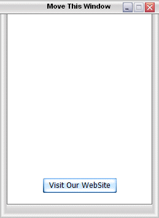

## Active Buttons

### Description

Classical Active Button Mechanism
 
### More Info
 

             |
---                |---
**Submitted On**   |2005-11-21 15:38:30
**By**             |[Michael Margold](https://github.com/Planet-Source-Code/PSCIndex/blob/master/ByAuthor/michael-margold.md)
**Level**          |Advanced
**User Rating**    |5.0 (10 globes from 2 users)
**Compatibility**  |VB 5\.0, VB 6\.0
**Category**       |[Graphics](https://github.com/Planet-Source-Code/PSCIndex/blob/master/ByCategory/graphics__1-46.md)
**World**          |[Visual Basic](https://github.com/Planet-Source-Code/PSCIndex/blob/master/ByWorld/visual-basic.md)
**Archive File**   |[Active\_But19503111222005\.zip](https://github.com/Planet-Source-Code/michael-margold-active-buttons__1-63339/archive/master.zip)

